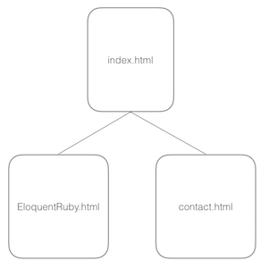

# Building Your First Website

Now we will use the skills you've learned to build pages of an online book review website. 

##  Learning Goals:

-  Demonstrate an understanding of HTML Syntax  
-  Demonstrate an understanding of appropriate tag selection for specific content.  
-  Demonstrate an ability to link local pages and remote pages.
-  Demonstrate the creation of a external stylesheet.  
-  Organize a site with [semantic](http://blog.teamtreehouse.com/use-html5-sectioning-elements) HTML.

## Wave 1 - Creating Semantic HTML
### The Online Book Review Site

In this exercise you will create the HTML to go along with content for 3 pages of HTML.  You will structure the content given in the content folder with semantic html tags providing meaning to the content.  

Each page will have a:
-  The standard Doctype, Head, and Body of an HTML page.  
-  A Header/Title Section
-  Navigation Section with links for the site
-  A footer with a copyright notice and your name

The pages of your site will pieces of an online book review site.  __[Under no circumstances should you use inline html styles.](http://stackoverflow.com/questions/2612483/whats-so-bad-about-in-line-css)__

### Site Homepage

For the homepage of your site, named `index.html` you will create a site with:
-  A Header section with the title for your book review site.
-  A section for navigation.
-  A main content section with an html unordered list of the top-5 book images (see the images folder) which will link to their pages in Amazon.com or book review pages.  

### Book Review Pages
You will then create a book review page template, using Eloquent Ruby by Russ Olsen and develop a structure for the site.  The content for the page is provided in the content folder by the textfile `index_content.txt`  The book review page will have the same structure as `index.html` except for the main content section.  The page will also include the image of book EloquentRuby.jpg

In the main content section you will need to structure the content inside the textfile. 

### Site Contact Page
You will also include a contact page for visitors to provide feedback to the maintainers.  

The page will include:

-  A Picture of the site maintainer, you can select a picture or use the goofy picture provided.
-  A statement welcoming feedback on the site via e-mail, twitter or facebook.

When you finish review the site with another student explaining your choices in terms of tags and sectioning of the pages.  Make adjustments as needed.  

## Wave 2 - Adding CSS

In This wave you will add CSS styling to change the appearance of the site.  You will be adding an external stylesheet named `style.css`.

In the style sheet you will need to discover how to:

-  Place the Header/Title section across the top of the site with a border and appropriate background color.
-  Provide an appropriate background color for the main content section
-  Select appropriate fonts & colors for text on the site.  
-  Make the navigation links display different colors when the mouse rolls over the link.  
-  Use CSS styling to hide the bullet-points of the unordered lists in the site.  
-  Place the Footer section across the entire bottom of the site with a border and an appropriate background color
 

Page Specific Styling:
-  `index.html` 
	-  use CSS styling to hide the bullet-points of the unordered list containing the book images.
	-  use CSS styling to make all the images the same height
-  Book Review Page
	-  The __Eloquent Ruby__ book image  

## Extensions
-  Create another page for a book you have found useful and link it into the navigation of the site.  
-  Attempt to create a more complex layout with content side-by-side as you feel appropriate.  
